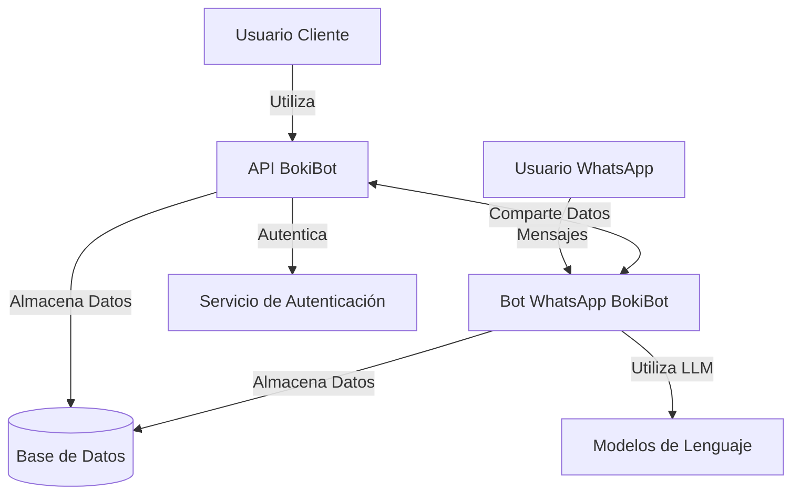
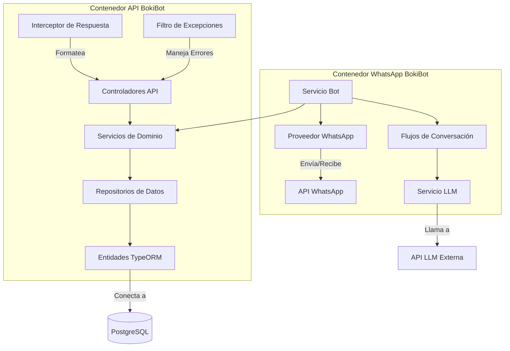

# Manual Técnico de BokiBot

## Arquitectura del Sistema

### Diagrama C2: Contexto del Sistema y Contenedores



El sistema BokiBot consta de dos contenedores principales:
1. **API BokiBot** - Aplicación NestJS que proporciona endpoints RESTful
2. **Bot WhatsApp BokiBot** - Maneja interacciones de WhatsApp usando @builderbot/bot

Estos contenedores comparten la misma base de código y base de datos, pero sirven diferentes interfaces a los usuarios.

### Diagrama C3: Arquitectura de Componentes



## Principios de Diseño Fundamentales

BokiBot está construido sobre los principios SOLID y patrones de arquitectura limpia para garantizar mantenibilidad y escalabilidad:

### Principio de Responsabilidad Única (SRP)
Cada clase tiene una sola razón para cambiar. Por ejemplo:
- **Controladores**: manejan solicitudes y respuestas HTTP
- **Servicios**: implementan lógica de negocio
- **Repositorios**: gestionan acceso a datos
- **Interceptores**: formatean respuestas
- **Filtros**: manejan excepciones

### Principio Abierto/Cerrado (OCP)
Los componentes están abiertos para extensión pero cerrados para modificación. Esto se logra mediante:
- **Clases base** como `BaseCrudController` y `BaseCrudService`
- **Puntos de extensión** a través de métodos protegidos como `validateCreate`, `prepareUpdateData`
- **Herencia** para extender funcionalidad sin modificar implementaciones base

### Principio de Sustitución de Liskov (LSP)
Las clases derivadas pueden sustituir a sus clases base sin alterar la corrección del programa:
- Cualquier controlador específico (ej., `UsersController`) puede usarse donde se espera un `BaseCrudController`
- Las implementaciones de servicio deben honrar los contratos definidos en las interfaces

### Principio de Segregación de Interfaces (ISP)
Los clientes no deben depender de interfaces que no usan:
- Interfaces enfocadas como `ICrudService` definen comportamientos específicos
- Los DTOs se mantienen mínimos y específicos para sus casos de uso

### Principio de Inversión de Dependencias (DIP)
Los módulos de alto nivel no dependen de módulos de bajo nivel; ambos dependen de abstracciones:
- Los servicios dependen de interfaces de repositorio, no de implementaciones concretas
- Se utiliza inyección de dependencias en toda la aplicación
- El contenedor IoC de NestJS gestiona las dependencias

## Estructura del Proyecto

```
src/
  |-- api/                     # Contenedor API
  |     |-- modules/           # Módulos de dominio
  |     |-- shared/            # Componentes compartidos
  |     |-- database/          # Configuración de base de datos
  |     |-- config/            # Configuración de aplicación
  |
  |-- bot/                     # Contenedor Bot WhatsApp
```

### Componentes Clave y Sus Roles

#### Capa API
- **Controladores**: Manejan peticiones HTTP, validan entradas, delegan a servicios
- **DTOs**: Definen objetos de transferencia de datos para validación de entrada
- **Esquemas**: Contienen reglas de validación Joi para los DTOs

#### Capa de Servicio
- **Servicios de Dominio**: Implementan lógica de negocio y orquestan operaciones
- **Servicios Base**: Proporcionan operaciones CRUD comunes para extender

#### Capa de Datos
- **Entidades**: Definen modelos de base de datos con TypeORM
- **Repositorios**: Gestionan acceso a datos y encapsulan consultas

#### Aspectos Transversales
- **Interceptores**: Formatean todas las respuestas de manera consistente
- **Filtros de Excepción**: Estandarizan el manejo de errores
- **Pipes de Validación**: Aseguran que los datos de entrada cumplan con las reglas

## Estándares de Respuesta API

BokiBot implementa un formato de respuesta estándar para todas las APIs:

```json
// Respuesta exitosa
{
  "status": "success",
  "message": "Operación completada exitosamente",
  "data": { ... }
}

// Respuesta de error
{
  "status": "error",
  "message": "Ha ocurrido un error",
  "errors": [
    {
      "code": "VALIDATION_ERROR",
      "field": "email",
      "message": "El email es inválido"
    }
  ]
}
```

Este formato se mantiene mediante:
- **Interceptor de Respuesta**: Transforma automáticamente todas las respuestas al formato estándar
- **Filtro de Excepciones HTTP**: Captura y formatea errores de manera consistente

## Validación con Joi

BokiBot utiliza Joi para validación de datos de entrada:

1. **Definición de esquemas**:
   ```typescript
   // schemas/userCreate.schema.ts
   export const createUserSchema = Joi.object({
     email: Joi.string().email().required(),
     password: Joi.string().min(8).required()
   });
   ```

2. **Uso en controladores**:
   ```typescript
   @Post()
   @UseJoiValidationPipe(instance => instance.createSchema)
   async create(@Body() createDto: CreateDto): Promise<ApiControllerResponse<T>> {
     // Implementación...
   }
   ```

## Cómo Ejecutar el Proyecto

### Requisitos Previos
- Node.js v16 o superior
- npm o yarn
- PostgreSQL

### Instalación

```bash
# Clonar el repositorio
git clone https://github.com/tu-usuario/bokibot.git
cd bokibot

# Instalar dependencias
npm install

# Configurar variables de entorno
cp .env.example .env
# Editar .env con tus configuraciones

# Ejecutar migraciones de base de datos
npm run migration:run
```

### Ejecución del Proyecto

```bash
# Modo desarrollo
npm run start:dev

# Modo producción
npm run build
npm start
```

### Depuración

BokiBot está configurado para una depuración sencilla usando VS Code:

#### Método 1: Usando VS Code directamente
1. Abrir el proyecto en VS Code
2. Presionar F5 o seleccionar "Debug NestJS con tsx (watch)" en el menú de depuración
3. Establecer puntos de interrupción donde lo necesites

#### Método 2: Terminal + VS Code
1. Ejecutar en la terminal: `npm run debug:simple`
2. En VS Code, seleccionar "Attach to Node Process"
3. Seleccionar el proceso de node que está ejecutando la aplicación

#### Uso de Puntos de Interrupción Explícitos
Si los puntos de interrupción no se activan correctamente, puedes añadir la palabra clave `debugger;` en tu código:

```typescript
intercept(context: ExecutionContext, next: CallHandler): Observable<ApiSuccessResponse<T>> {
  debugger; // El depurador se detendrá aquí
  // Resto del código...
}
```

## Creando un Nuevo Módulo

Para crear un nuevo módulo en BokiBot, sigue estos pasos:

### 1. Estructura de Carpetas

Crea la siguiente estructura:

```
src/api/modules/tu-modulo/
  |-- controllers/
  |     |-- tu-modulo.controller.ts
  |
  |-- services/
  |     |-- tu-modulo.service.ts
  |
  |-- dto/
  |     |-- tu-modulo-create.dto.ts
  |     |-- tu-modulo-update.dto.ts
  |
  |-- entities/
  |     |-- tu-modulo.entity.ts
  |
  |-- schemas/
  |     |-- tu-modulo-create.schema.ts
  |     |-- tu-modulo-update.schema.ts
  |
  |-- tu-modulo.module.ts
```

### 2. Define la Entidad

```typescript
// entities/tu-modulo.entity.ts
import { Entity, PrimaryGeneratedColumn, Column } from 'typeorm';

@Entity('tu_tabla')
export class TuModuloEntity {
  @PrimaryGeneratedColumn()
  id: number;

  @Column()
  nombre: string;

  // Otras propiedades...
}
```

### 3. Crea DTOs y Esquemas

```typescript
// dto/tu-modulo-create.dto.ts
export class CreateTuModuloDto {
  nombre: string;
  // Otras propiedades...
}

// schemas/tu-modulo-create.schema.ts
import * as Joi from 'joi';

export const createTuModuloSchema = Joi.object({
  nombre: Joi.string().required(),
  // Reglas de validación...
});
```

### 4. Implementa el Servicio

```typescript
// services/tu-modulo.service.ts
import { Injectable } from '@nestjs/common';
import { InjectRepository } from '@nestjs/typeorm';
import { Repository } from 'typeorm';
import { TuModuloEntity } from '../entities/tu-modulo.entity';
import { CreateTuModuloDto } from '../dto/tu-modulo-create.dto';
import { UpdateTuModuloDto } from '../dto/tu-modulo-update.dto';
import { BaseCrudService } from '../../../shared/services/crud.services';

@Injectable()
export class TuModuloService extends BaseCrudService<TuModuloEntity, CreateTuModuloDto, UpdateTuModuloDto> {
  constructor(
    @InjectRepository(TuModuloEntity)
    private readonly tuModuloRepository: Repository<TuModuloEntity>
  ) {
    super(tuModuloRepository);
  }

  // Métodos personalizados o sobreescrituras...
}
```

### 5. Implementa el Controlador

```typescript
// controllers/tu-modulo.controller.ts
import { Controller, Inject } from '@nestjs/common';
import { TuModuloService } from '../services/tu-modulo.service';
import { TuModuloEntity } from '../entities/tu-modulo.entity';
import { CreateTuModuloDto } from '../dto/tu-modulo-create.dto';
import { UpdateTuModuloDto } from '../dto/tu-modulo-update.dto';
import { BaseCrudController } from '../../../shared/controllers/crud.controller';
import { createTuModuloSchema } from '../schemas/tu-modulo-create.schema';
import { updateTuModuloSchema } from '../schemas/tu-modulo-update.schema';

@Controller('tu-modulo')
export class TuModuloController extends BaseCrudController<TuModuloEntity, CreateTuModuloDto, UpdateTuModuloDto> {
  constructor(
    @Inject(TuModuloService)
    private readonly tuModuloService: TuModuloService
  ) {
    super(tuModuloService, 'tu-modulo', createTuModuloSchema, updateTuModuloSchema);
  }

  // Endpoints personalizados...
}
```

### 6. Define el Módulo

```typescript
// tu-modulo.module.ts
import { Module } from '@nestjs/common';
import { TypeOrmModule } from '@nestjs/typeorm';
import { TuModuloController } from './controllers/tu-modulo.controller';
import { TuModuloService } from './services/tu-modulo.service';
import { TuModuloEntity } from './entities/tu-modulo.entity';

@Module({
  imports: [TypeOrmModule.forFeature([TuModuloEntity])],
  controllers: [TuModuloController],
  providers: [TuModuloService],
  exports: [TuModuloService],
})
export class TuModuloModule {}
```

### 7. Integra en AppModule

```typescript
// app.module.ts
import { Module } from '@nestjs/common';
import { TuModuloModule } from './modules/tu-modulo/tu-modulo.module';

@Module({
  imports: [
    // Otros módulos...
    TuModuloModule,
  ],
})
export class AppModule {}
```

## Mejores Prácticas

1. **Mantén las interfaces limpias**: Los DTOs deben definir solo propiedades, sin lógica.
2. **Separa validación de definición de datos**: Usa esquemas Joi para validación, no decoradores en DTOs.
3. **Extiende, no modifiques**: Utiliza los puntos de extensión proporcionados en clases base.
4. **Manejo consistente de errores**: Lanza excepciones estándar (BadRequestException, NotFoundException, etc.).
5. **Prueba los límites de tu dominio**: Implementa validaciones personalizadas en los métodos `validateCreate`, `validateUpdate`.

## Conclusión

BokiBot está diseñado siguiendo principios sólidos de arquitectura que facilitan el mantenimiento y la extensión del sistema. La arquitectura en capas, los componentes base reutilizables y los mecanismos de respuesta estandarizados permiten a los desarrolladores centrarse en implementar funcionalidades de negocio sin preocuparse por los detalles de infraestructura.

Al seguir las guías de este manual, podrás contribuir al proyecto manteniendo la consistencia y calidad del código establecidas.
