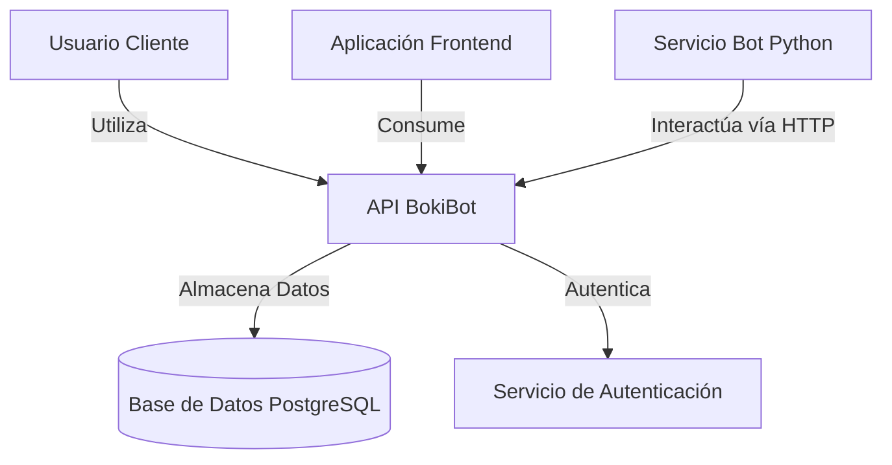
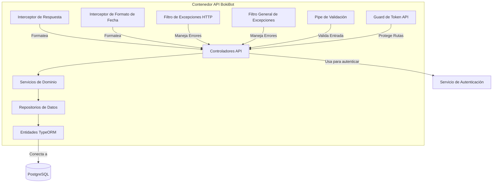

# Manual Técnico de BokiBot API

## Arquitectura del Sistema

### Diagrama C2: Contexto del Sistema y Contenedores



El sistema BokiBot API es una aplicación NestJS que proporciona endpoints RESTful. Interactúa con una aplicación Frontend, un Bot externo desarrollado en Python (en un repositorio separado) y una base de datos PostgreSQL.

### Diagrama C3: Arquitectura de Componentes API



### Diagrama de Flujo de Solicitud API (Estado)

```mermaid
stateDiagram-v2
    [*] --> Recibiendo_Solicitud
    Recibiendo_Solicitud --> Middleware_Globales: Pasa por middleware (CORS, logging, etc.)
    Middleware_Globales --> Routing: NestJS dirige a ruta específica
    Routing --> Guards: Ejecución de Guards (ApiTokenGuard)
    Guards -- Fracaso --> Filtro_Excepciones
    Guards -- Éxito --> Pipes_Validacion: Validación de DTOs
    Pipes_Validacion -- Fracaso --> Filtro_Excepciones
    Pipes_Validacion -- Éxito --> Controlador: Método del controlador invocado
    Controlador --> Servicio: Llama al servicio de dominio
    Servicio --> Repositorio: Accede/Modifica datos
    Repositorio --> Base_de_Datos: Interactúa con BD
    Base_de_Datos --> Repositorio: Retorna datos/estado
    Repositorio --> Servicio: Retorna resultado a servicio
    Servicio --> Controlador: Retorna resultado al controlador
    Controlador --> Interceptor_Respuesta: Transforma respuesta
    Interceptor_Respuesta --> Interceptor_Formato_Fecha: Formatea fechas en respuesta
    Interceptor_Formato_Fecha --> Envio_Respuesta: Respuesta HTTP enviada al cliente
    Envio_Respuesta --> [*]
    Filtro_Excepciones --> Envio_Respuesta: Formatea y envía error HTTP
```

## Principios de Diseño Fundamentales

BokiBot API está construido sobre los principios SOLID y patrones de arquitectura limpia para garantizar mantenibilidad y escalabilidad:

### Principio de Responsabilidad Única (SRP)
Cada clase tiene una sola razón para cambiar. Por ejemplo:
- **Controladores**: manejan solicitudes y respuestas HTTP
- **Servicios**: implementan lógica de negocio
- **Repositorios**: gestionan acceso a datos
- **Interceptores**: formatean respuestas
- **Filtros**: manejan excepciones

### Principio Abierto/Cerrado (OCP)
Los componentes están abiertos para extensión pero cerrados para modificación. Esto se logra mediante:
- **Clases base** como `BaseCrudController` y `BaseCrudService`
- **Puntos de extensión** a través de métodos protegidos como `validateCreate`, `prepareUpdateData`
- **Herencia** para extender funcionalidad sin modificar implementaciones base

### Principio de Sustitución de Liskov (LSP)
Las clases derivadas pueden sustituir a sus clases base sin alterar la corrección del programa:
- Cualquier controlador específico (ej., `UsersController`) puede usarse donde se espera un `BaseCrudController`
- Las implementaciones de servicio deben honrar los contratos definidos en las interfaces

### Principio de Segregación de Interfaces (ISP)
Los clientes no deben depender de interfaces que no usan:
- Interfaces enfocadas como `ICrudService` definen comportamientos específicos
- Los DTOs se mantienen mínimos y específicos para sus casos de uso

### Principio de Inversión de Dependencias (DIP)
Los módulos de alto nivel no dependen de módulos de bajo nivel; ambos dependen de abstracciones:
- Los servicios dependen de interfaces de repositorio, no de implementaciones concretas
- Se utiliza inyección de dependencias en toda la aplicación
- El contenedor IoC de NestJS gestiona las dependencias

## Estructura del Proyecto

```
src/
  |-- api/                     # Contenedor API
  |     |-- modules/           # Módulos de dominio
  |     |     |-- appointment/ # Módulo de citas
  |     |     |-- categoryService/ # Módulo de categorías de servicio
  |     |     |-- client/      # Módulo de clientes
  |     |     |-- company/     # Módulo de empresas
  |     |     |-- companyBranch/ # Módulo de sucursales
  |     |     |-- faqs/        # Módulo de preguntas frecuentes
  |     |     |-- professional/ # Módulo de profesionales
  |     |     |-- service/     # Módulo de servicios
  |     |     |-- tags/        # Módulo de etiquetas
  |     |     |-- users/       # Módulo de usuarios
  |     |
  |     |-- shared/            # Componentes compartidos (interceptors, filters, pipes, services base)
  |     |-- database/          # Configuración de base de datos, migraciones, entidades
  |     |     |-- migrations/  # Migraciones TypeORM
  |     |     |-- seeds/       # Seeders para datos iniciales
  |     |
  |     |-- config.ts          # Configuración de la API
  |     |-- main.ts            # Punto de entrada de la aplicación API
  |     |-- app.module.ts      # Módulo raíz de la aplicación API
  |
  |-- app.ts                   # Punto de entrada principal de la aplicación
```

### Componentes Clave y Sus Roles

#### Capa API
- **Controladores**: Manejan peticiones HTTP, validan entradas, delegan a servicios
- **DTOs**: Definen objetos de transferencia de datos para validación de entrada
- **Esquemas**: Contienen reglas de validación para los DTOs

#### Capa de Servicio
- **Servicios de Dominio**: Implementan lógica de negocio y orquestan operaciones
- **Servicios Base**: Proporcionan operaciones CRUD comunes para extender

#### Capa de Datos
- **Entidades**: Definen modelos de base de datos con TypeORM
- **Repositorios**: Gestionan acceso a datos y encapsulan consultas

#### Aspectos Transversales
- **Interceptores**:
  - **ResponseInterceptor**: Formatea todas las respuestas de manera consistente
  - **DateFormatInterceptor**: Formatea fechas en las respuestas
- **Filtros de Excepción**:
  - **HttpExceptionFilter**: Estandariza el manejo de errores HTTP
  - **AllExceptionsFilter**: Captura y maneja cualquier excepción no controlada
- **Pipes de Validación**: Aseguran que los datos de entrada cumplan con las reglas
- **Guards**: Protegen rutas según requisitos de autenticación/autorización

## Estándares de Respuesta API

BokiBot implementa un formato de respuesta estándar para todas las APIs:

```json
// Respuesta exitosa
{
  "status": "success",
  "message": "Operación completada exitosamente",
  "data": { ... }
}

// Respuesta de error
{
  "status": "error",
  "message": "Ha ocurrido un error",
  "errors": [
    {
      "code": "VALIDATION_ERROR",
      "field": "email",
      "message": "El email es inválido"
    }
  ]
}
```

Este formato se mantiene mediante:
- **Interceptor de Respuesta**: Transforma automáticamente todas las respuestas al formato estándar
- **Filtro de Excepciones HTTP**: Captura y formatea errores de manera consistente

## Validación

BokiBot utiliza el módulo de validación incorporado de NestJS junto con class-validator:

1. **Definición de DTOs**:
   ```typescript
   // dto/create-user.dto.ts
   import { IsEmail, IsString, MinLength } from 'class-validator';

   export class CreateUserDto {
     @IsEmail()
     email: string;

     @IsString()
     @MinLength(8)
     password: string;
   }
   ```

2. **Uso en controladores**:
   ```typescript
   @Post()
   async create(@Body() createDto: CreateUserDto): Promise<ApiControllerResponse<T>> {
     // Implementación...
   }
   ```

## Cómo Ejecutar el Proyecto

### Requisitos Previos
- Node.js v18 o superior
- npm o yarn
- PostgreSQL
- Un servicio de autenticación externo (si aplica según configuración)

### Instalación

```bash
# Clonar el repositorio
git clone https://github.com/tu-usuario/bokibot-api.git
cd bokibot-api

# Instalar dependencias
npm install

# Configurar variables de entorno (crear archivo .env)
# Variables necesarias:
# API_PORT=3000
# POSTGRES_DB_HOST=localhost
# POSTGRES_DB_PORT=5432
# POSTGRES_DB_USER=postgres
# POSTGRES_DB_PASSWORD=your_password
# POSTGRES_DB_NAME=bokibot_db

# Ejecutar migraciones de base de datos
npm run migration:run
```

### Ejecución del Proyecto

```bash
# Modo desarrollo
npm run start:dev

# Modo producción
npm run build
npm start
```

### Depuración

BokiBot está configurado para una depuración sencilla usando VS Code:

#### Método 1: Usando VS Code directamente
1. Abrir el proyecto en VS Code
2. Presionar F5 o seleccionar "Debug NestJS" en el menú de depuración
3. Establecer puntos de interrupción donde lo necesites

#### Método 2: Terminal + VS Code
1. Ejecutar en la terminal: `npm run debug:simple`
2. En VS Code, seleccionar "Attach to Node Process"
3. Seleccionar el proceso de node que está ejecutando la aplicación

## Creando un Nuevo Módulo

Para crear un nuevo módulo en BokiBot API, sigue estos pasos:

### 1. Estructura de Carpetas

Crea la siguiente estructura dentro de `src/api/modules/`:

```
src/api/modules/tu-modulo/
  |-- controllers/
  |     |-- tu-modulo.controller.ts
  |
  |-- services/
  |     |-- tu-modulo.service.ts
  |
  |-- dto/
  |     |-- tu-modulo-create.dto.ts
  |     |-- tu-modulo-update.dto.ts
  |
  |-- entities/
  |     |-- tu-modulo.entity.ts
  |
  |-- tu-modulo.module.ts
```

### 2. Define la Entidad

```typescript
// entities/tu-modulo.entity.ts
import { Entity, PrimaryGeneratedColumn, Column } from 'typeorm';

@Entity('tu_tabla')
export class TuModuloEntity {
  @PrimaryGeneratedColumn()
  id: number;

  @Column()
  nombre: string;

  // Otras propiedades...
}
```

### 3. Crea DTOs

```typescript
// dto/tu-modulo-create.dto.ts
import { IsString, IsNotEmpty } from 'class-validator';

export class CreateTuModuloDto {
  @IsString()
  @IsNotEmpty()
  nombre: string;

  // Otras propiedades...
}
```

### 4. Implementa el Servicio

```typescript
// services/tu-modulo.service.ts
import { Injectable } from '@nestjs/common';
import { InjectRepository } from '@nestjs/typeorm';
import { Repository } from 'typeorm';
import { TuModuloEntity } from '../entities/tu-modulo.entity';
import { CreateTuModuloDto } from '../dto/tu-modulo-create.dto';
import { UpdateTuModuloDto } from '../dto/tu-modulo-update.dto';

@Injectable()
export class TuModuloService {
  constructor(
    @InjectRepository(TuModuloEntity)
    private readonly tuModuloRepository: Repository<TuModuloEntity>
  ) {}

  async findAll() {
    return this.tuModuloRepository.find();
  }

  async findOne(id: number) {
    return this.tuModuloRepository.findOneBy({ id });
  }

  async create(createDto: CreateTuModuloDto) {
    const newEntity = this.tuModuloRepository.create(createDto);
    return this.tuModuloRepository.save(newEntity);
  }

  async update(id: number, updateDto: UpdateTuModuloDto) {
    await this.tuModuloRepository.update(id, updateDto);
    return this.findOne(id);
  }

  async remove(id: number) {
    const entity = await this.findOne(id);
    return this.tuModuloRepository.remove(entity);
  }
}
```

### 5. Implementa el Controlador

```typescript
// controllers/tu-modulo.controller.ts
import { Controller, Get, Post, Body, Param, Put, Delete } from '@nestjs/common';
import { TuModuloService } from '../services/tu-modulo.service';
import { CreateTuModuloDto } from '../dto/tu-modulo-create.dto';
import { UpdateTuModuloDto } from '../dto/tu-modulo-update.dto';

@Controller('tu-modulo')
export class TuModuloController {
  constructor(
    private readonly tuModuloService: TuModuloService
  ) {}

  @Get()
  async findAll() {
    return this.tuModuloService.findAll();
  }

  @Get(':id')
  async findOne(@Param('id') id: number) {
    return this.tuModuloService.findOne(id);
  }

  @Post()
  async create(@Body() createDto: CreateTuModuloDto) {
    return this.tuModuloService.create(createDto);
  }

  @Put(':id')
  async update(@Param('id') id: number, @Body() updateDto: UpdateTuModuloDto) {
    return this.tuModuloService.update(id, updateDto);
  }

  @Delete(':id')
  async remove(@Param('id') id: number) {
    return this.tuModuloService.remove(id);
  }
}
```

### 6. Define el Módulo

```typescript
// tu-modulo.module.ts
import { Module } from '@nestjs/common';
import { TypeOrmModule } from '@nestjs/typeorm';
import { TuModuloController } from './controllers/tu-modulo.controller';
import { TuModuloService } from './services/tu-modulo.service';
import { TuModuloEntity } from './entities/tu-modulo.entity';

@Module({
  imports: [TypeOrmModule.forFeature([TuModuloEntity])],
  controllers: [TuModuloController],
  providers: [TuModuloService],
  exports: [TuModuloService],
})
export class TuModuloModule {}
```

### 7. Integra en AppModule

```typescript
// app.module.ts
import { Module } from '@nestjs/common';
import { TuModuloModule } from './modules/tu-modulo/tu-modulo.module';

@Module({
  imports: [
    // Otros módulos...
    TuModuloModule,
  ],
})
export class AppModule {}
```

## Variables de Entorno

El proyecto requiere las siguientes variables de entorno:

```
# Configuración de la API
API_PORT=3000                           # Puerto en el que escucha la API

# Configuración de Base de Datos
POSTGRES_DB_HOST=localhost              # Host de la base de datos PostgreSQL
POSTGRES_DB_PORT=5432                   # Puerto de PostgreSQL
POSTGRES_DB_USER=postgres               # Usuario de PostgreSQL
POSTGRES_DB_PASSWORD=your_password      # Contraseña de PostgreSQL
POSTGRES_DB_NAME=bokibot_db             # Nombre de la base de datos

# Configuración de Seguridad
API_TOKEN_SECRET=your_api_token_secret  # Secreto para los tokens de API
```

## Mejores Prácticas

1. **Mantén las interfaces limpias**: Los DTOs deben definir solo propiedades, junto con sus validaciones.
2. **Separa la lógica de negocio**: Mantén la lógica de negocio en los servicios, no en los controladores.
3. **Extiende, no modifiques**: Utiliza la herencia para extender funcionalidad.
4. **Manejo consistente de errores**: Lanza excepciones estándar (BadRequestException, NotFoundException, etc.).
5. **Documentación con Swagger**: Usa decoradores Swagger para documentar tus APIs.

## Conclusión

BokiBot API está diseñado siguiendo principios sólidos de arquitectura que facilitan el mantenimiento y la extensión del sistema. La arquitectura en capas, los componentes reutilizables y los mecanismos de respuesta estandarizados permiten a los desarrolladores centrarse en implementar funcionalidades de negocio sin preocuparse por los detalles de infraestructura.

Al seguir las guías de este manual, podrás contribuir al proyecto `bokibot-api` manteniendo la consistencia y calidad del código establecidas.
